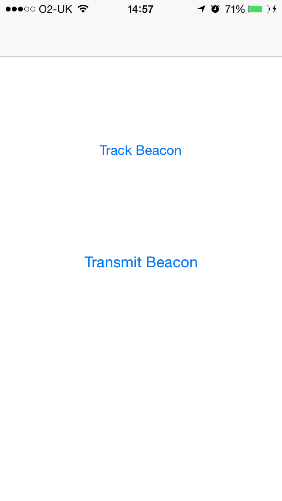
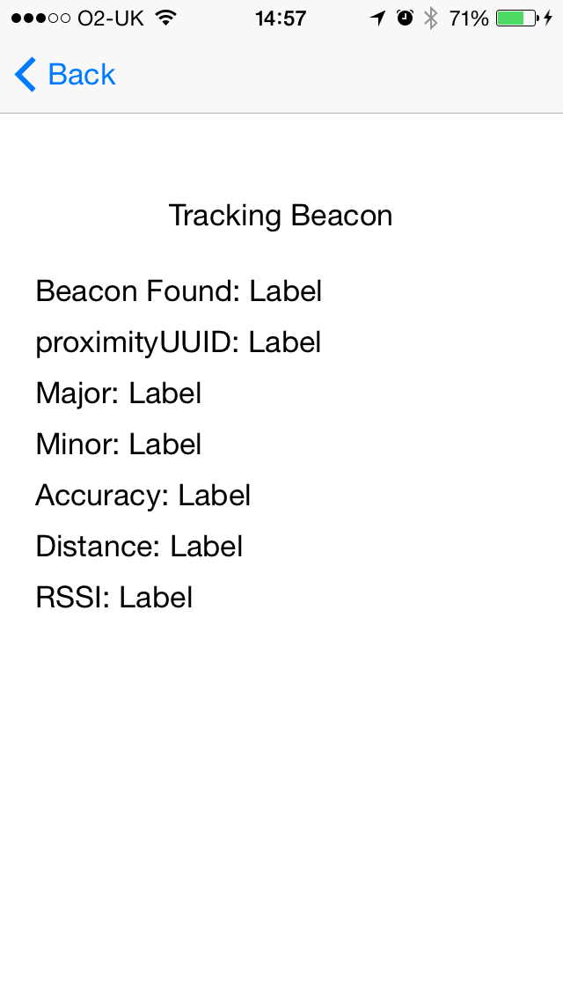
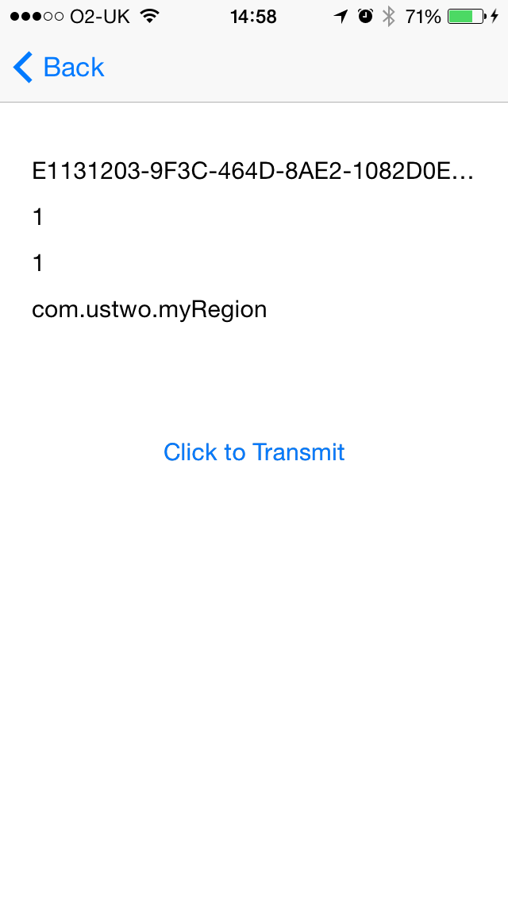

ibeacon-demo
============

iOS project example that uses iBeacon API's in either transmitter or scanner mode

## Requirements

- OS X
- Xcode
- dedicated 3rd party iBeacon hardware  e.g. Estimote or an iOS device that supports Bluetooth LE (for use as an iBeacon transmitter)

## Usage

### Update

If you are using dedicated 3rd party iBeacon hardware paste its UUID as the value of the <code>kBeaconIdentifier</code> constant

Otherwise if you are using an iOS device as an iBeacon (transmitter) instead first generate a UUID for it by opening a Terminal on Mac and type the following command

<code>uuidgen</code>

and paste the UUID output as the value of the <code>kBeaconIdentifier</code> constant

### Transmitter mode 

Note. only required if you are using an iOS device as an iBeacon (see above)

Deploy the applicaiton on the device and select the 'Transmit Beacon' option and when ready the 'Click to Transmit' button

The application on the device is now acting as an iBeacon transmitter

### Tracker mode

Deploy the app to another iOS device and choose the 'Track Beacon' option

Deploy the applicaiton on the device and select the 'Track Beacon' option. 

The application on the device is now acting as a scanner that will update as it comes into and out of range of the iBeacon(s)

## Team

* Development: [Shagun Madhikarmi](mailto:shagun@ustwo.com?subject=ibeacon-demo)

## Screenshots

#### Home screen

#### Transmitter mode

#### Tracker mode

